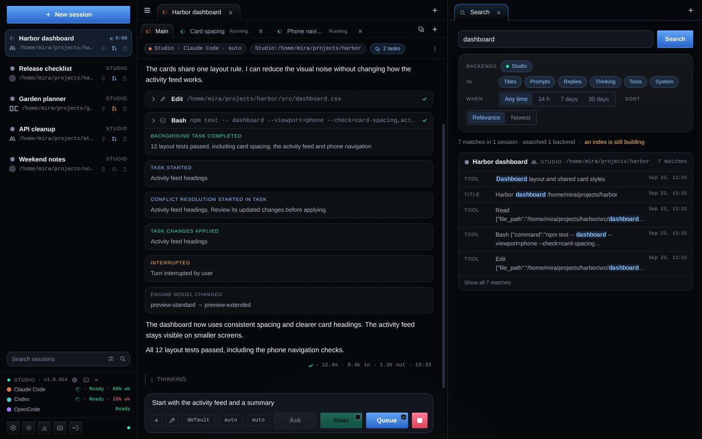
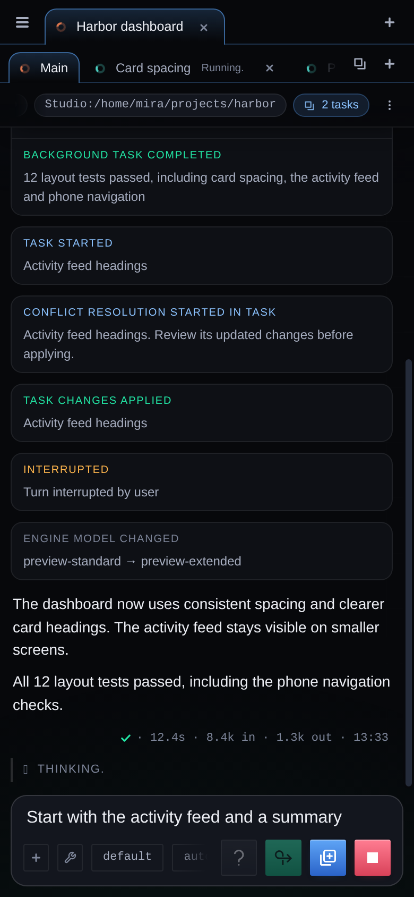
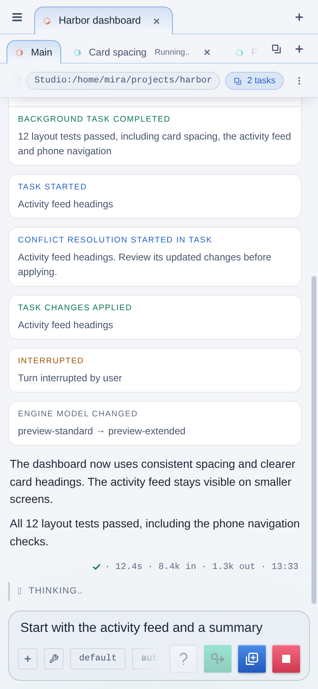
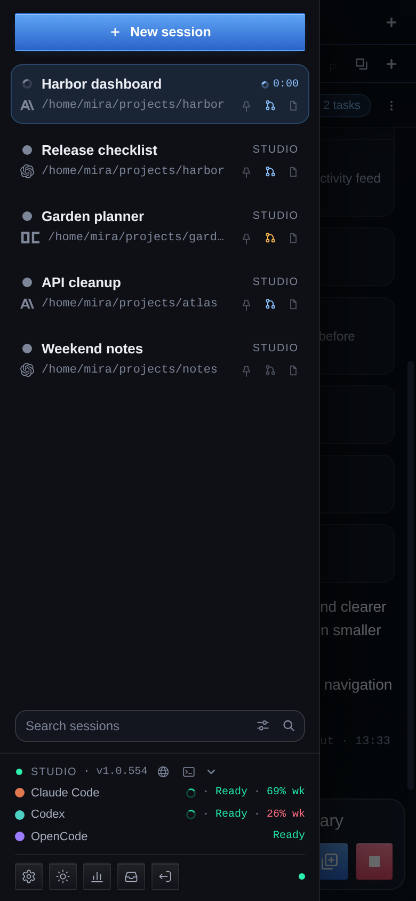
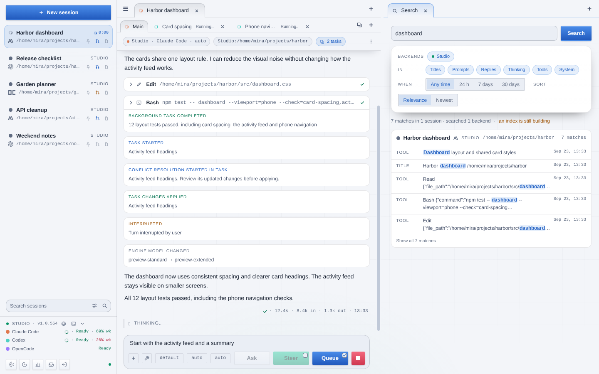

<p align="center">
  
</p>

<h1 align="center">Puppy 🐾</h1>

<p align="center"><strong>One persistent web console for every coding agent you run.</strong><br>
Drive <b>Claude Code</b>, <b>Codex</b> and <b>OpenCode</b> from your browser, from your phone, across every machine you own.</p>

<p align="center">
  <a href="#quick-start">Quick start</a> ·
  <a href="#the-tour">The tour</a> ·
  <a href="#multi-machine">Multi-machine</a> ·
  <a href="#settings">Settings</a> ·
  <a href="#data-privacy-and-security">Security</a> ·
  <a href="#tests">Tests</a> ·
  <a href="#license">License</a>
</p>

---

Puppy runs the official `claude`, `codex` and `opencode` CLIs for you, turns their
raw event streams into one clean, searchable transcript, and keeps that transcript
and every session forever in its own SQLite database. Close the laptop, open your
phone, and the same conversation is waiting for you, with your half-typed prompt
still in the box.

There is no build step, no npm, no daemon besides Puppy itself: Python 3.9+,
`aiohttp`, and the agent CLIs you already have.

## Why Puppy

- **Every engine, one console.** Claude Code, Codex and OpenCode sessions sit side
  by side. A session can switch engines at any time and the new engine picks up
  the story from a transcript handoff.
- **Talk to the agent while it works.** Steer a running turn, ask it a side
  question it answers without derailing its work, queue the next prompts, approve
  or deny tool calls and answer the questions it asks you, all from the same box.
- **Tasks in parallel.** Spin off tasks that work in isolated Git clones of your
  project, review their diffs, and apply the winners to your working tree.
- **A fleet, not a box.** Pair other machines as backends, run sessions there,
  attach shared terminals and managed browsers on any of them, and let agents
  delegate one-shot jobs or talk to other sessions across the fleet.
- **Nothing gets lost.** Durable message queues, drafts that follow you between
  devices, full-history search, and one-click backup and restore.
- **Type together without losing your place.** On backends with typing presence,
  the chat shows when another console is typing, and while you are not editing
  yourself your caret follows theirs to the spot being written (a long draft
  scrolls to it), so picking the draft up on this device continues exactly
  where the other one left off. Concurrent edits keep your
  text, caret, and attachments in place; **Review drafts** lets you compare
  your local version with the shared one, keep editing, use the shared draft,
  or share yours. A conflicting local draft survives reloads in that browser's
  draft journal. Sending it submits your version and preserves a different
  shared draft. The indicator stops after a pause or disconnect and respects
  reduced motion.
- **Built for the phone.** A responsive layout, a swipeable sidebar drawer, and
  light and dark themes. Overflowing tab and chip strips fade their contents at
  the edges while surrounding borders stay visible. Menus close when you tap or
  move focus elsewhere, including when you open the sidebar.

<p align="center">
  
  &nbsp;&nbsp;
  
  &nbsp;&nbsp;
  
</p>

The screenshots above use fictional demo people, projects and hosts.

## Quick start

```sh
git clone <repository-url> puppy
cd puppy
python3 -m venv .venv
.venv/bin/python -m pip install -r requirements.txt
PUPPY_PYTHON="$PWD/.venv/bin/python" ./run.sh  # http://127.0.0.1:10888
```

Open `http://127.0.0.1:10888` on the host and create the administrator account.
Fresh installs listen on loopback only; move the listener to another address
from Settings once the account exists. Sign in to the engines with their own
tools (`claude auth login`, `codex login`, OpenCode's provider authentication) as
the user that runs Puppy.

**Requirements**

- Linux with Bash.
- Python 3.9 or newer with SQLite FTS5 support and `aiohttp` (the sole direct
  Python dependency). The commands above also need Python's `venv` and `pip` support.
- One or more of the `claude`, `codex` and `opencode` CLIs on the service's
  `PATH` (OpenCode is also found at `$HOME/.opencode/bin/opencode`).
- Git, if you want to use Tasks.
- Optional: a Chromium or Chrome binary (major version 112 or newer, on `PATH`
  or named by `PUPPY_BROWSER_BIN`) for managed browsers.
- Optional: the `openssl` command for generating self-signed HTTPS certificates
  on the console or a headless backend. Imported certificates do not need it.

`run.sh` uses `python3` from `PATH`; set `PUPPY_PYTHON` to an absolute
interpreter path to use a specific virtual environment. Run it under whichever
service manager your host uses, preserving that interpreter setting and the
service user's `HOME` and engine `PATH`. If `aiohttp` is already installed for
your chosen interpreter, you can run `./run.sh` directly. The default project
directory is the service user's home; change it in Settings. Private state
defaults to `data/` beside the source; set `PUPPY_DATA` to an absolute directory
to keep it elsewhere. Restart settings are described under
[Security](#data-privacy-and-security).

## The tour

<p align="center">
  
</p>

### Sessions that live as long as you want

A session is a working directory plus an engine, a model, a reasoning effort
and a permission mode. Puppy spawns the engine CLI for every turn, resumes the
engine's own native session by id, and records everything the engine says as a
normalized transcript: prompts, replies, thinking, tool calls with their results,
side questions, engine switches and a result line for every turn with elapsed
time, tokens in and out, and, when the engine reports it, how full the model's
context is. Tool cards and folded-task headers share a vertically centered row
for their carets, icons and status marks, with equal spacing from the chevron to
the tool icon and from the icon to its label. Reading at the foot of a live
transcript keeps you there: a card that grows where it stands - a background
task ending, an answer to a side question, a result dropped into a card you
opened - carries the view down with it, exactly as a new message does, while a
reading anywhere further up is never pulled away from it.

- **Three workspaces to choose from.** Point a session at a project directory,
  start it in a private disposable **Scratch** workspace with no folder to
  choose, or work on a project that lives on another backend
  (see [Remote workspaces](#remote-workspaces)).
- **Keep a scratch project.** Choose **Move to directory** in the session menu
  to move its files into a new folder on the same backend, including on another
  filesystem. Choose an existing parent outside Puppy's data directory and a
  destination that does not exist. The session must be idle with no queued or
  held work and no tasks. The conversation stays; the next turn starts fresh
  engine context with a transcript handoff. Reopen terminals after moving.
  Deleting the session then leaves the project files intact. Permanent project
  directories are outside Puppy's backup coverage.
- **Model, effort and permissions per session.** Each engine's model catalog
  and per-model effort levels are discovered from the CLI itself, with a
  provisional fallback list until a catalog loads. Claude offers its aliases
  and effort levels, Codex its models
  and reasoning efforts (plus **Fast mode** where the catalog offers a Fast
  tier), OpenCode every provider model that installation knows. Change any of
  them mid-conversation; while work is pending the change waits its turn in
  the queue and applies in order, its row naming both sides of every field
  (*Effort Max → Medium*) against what is in force where it stands - the
  session's settings plus every change queued ahead of it, or the whole
  queue for a held row, which re-sends to the queue's end. Claude's saved
  aliases and full model IDs, including `[1m]` context selectors, use the
  matching catalog name and effort
  choices without rewriting the saved request: every spelling the CLI has
  shown for a model stays that model's alias across catalog refreshes, a
  running turn's picker adds to the list rather than replacing it, and a
  saved default or session model the list does not name is resolved by
  the CLI itself, so a catalogued model never reads as Custom… because a
  later turn spelled it differently. A catalog that has never
  loaded successfully keeps unlisted saved choices visible by ID until it does.
- **Engine defaults per backend.** Save the starting permission, model and
  effort for each engine; new sessions, tasks and engine switches start from them.
- **Switch engines any time.** A session can move between installed engines.
  The new engine starts a fresh native session seeded with a handoff of the
  conversation so far, in the same working directory.
- **Session tools.** Claude, Codex and OpenCode sessions can **Compact context**
  using the engine's own compaction. Claude and Codex also offer **Undo last
  turn** to drop the last prompt and reply from the engine's memory without
  touching your files. OpenCode verifies the native summary. If an operation
  begins changing context and is interrupted or cannot be verified, Puppy
  holds queued work and prepares fresh engine context from its bounded
  transcript handoff for your next prompt.
- **Pins, colors, archive, drag-and-drop.** Sessions carry a color, can be
  pinned to the top, archived out of the way, renamed, and reordered by
  dragging. Every list reordered by dragging - sessions, the footer's
  backends, tabs and queued prompts - scrolls itself while the dragged item
  is held near its edge, faster toward the edge, and keeps scrolling with
  the item at the last visible slot while it is held past that edge over
  the rest of the sidebar, tab bar or queue box; releasing it there still
  lands it. New session preselects a least-used color across the console's
  known sessions on all backends, including archived sessions, breaking ties
  randomly; you can choose another color. The order belongs to the backend,
  so every console sees the same list. Session context menus stay within the screen and scroll when there
  are more actions than the available height.
- **Git repositories.** A branch mark on every session row, between the pin
  and the agent notes, shows whether the session's directory is inside a Git
  repository - and turns orange when that repository is holding work you have
  not committed or pushed: uncommitted changes (staged, unstaged or untracked)
  or commits that no remote has yet. Its label says how much of each, or
  "nothing to commit or push", and hovering an orange mark shows why in a few
  lines: the branch, the changes sorted into staged, unstaged, untracked and
  conflicts, and the commits no remote has. A repository with no remote has
  nowhere to push to and is never flagged for its commits. The backend that runs the session
  checks its directory every 15 minutes (Settings → Timers), whenever you open
  or switch to the session, and every time a prompt finishes in it - a task's
  prompts excepted, since a task works in its own clone; applying a task's
  changes to Main re-checks Main instead. A directory it has not looked at
  yet, or could not read, keeps a faint mark with the reason in its label, and
  a repository whose state `git` refuses to read keeps the plain mark with
  `git`'s reason. Click a repository's mark to see exactly what is behind it:
  the sheet names the session and its directory, the branch, its upstream and
  how far ahead or behind it is, the state that gives the mark its colour, and
  lists the changes themselves -
  every path grouped as `git status` groups them (staged, unstaged, untracked,
  conflicts) with what `git` would do with it - and every unpushed commit with
  its hash, subject, author and time (the first 500 paths and 200 commits,
  the rest counted). Under those, **History** is the short log of everything
  on the branch, listed exactly as the unpushed commits are (hash, subject,
  author and time), read a hundred
  commits at a time: the first hundred once the sheet has read the
  repository, the next hundred whenever the list is scrolled to its foot or
  its **Load more** is pressed, the caption counting them all. It reads the
  repository afresh when opened and on
  Refresh, and the mark follows what it finds. The sheet also acts on the
  two counts: **Push** appears while there are commits to push and somewhere
  to push them - the branch's upstream, or the only remote, which the push
  then makes its upstream - and sends them there (no force; a rejected push
  reports `git`'s reason inline, and a push still running after five seconds
  can be cancelled); **Revert** appears while there are uncommitted changes
  and, after a confirmation that spells out what goes, discards every one
  of them - tracked paths return to the last commit, untracked paths are
  deleted, ignored files and nested repositories are left alone, and a merge
  stopped on a conflict is abandoned. Both are refused while a turn is running
  or queued in any session on that project, or while a task is being prepared
  or applied to it, and a prompt sent to the session meanwhile waits for them.
  A mark that says "no repository", "not checked yet" or "could not be
  checked" opens nothing.
- **Agent notes.** A mark on every session row shows whether its directory has
  an `AGENTS.md` or `CLAUDE.md`, and opens a small editor for exactly those two
  files.
- **Session titles come free.** An unnamed session takes its title from the
  first line of its first prompt. With **Session titles** switched on in
  Settings, a model can write a better one: the New session dialog offers
  **Generate a title from the first message** (on by default, and stepping
  aside for a name you type), the first line stands in while the chosen
  engine, model and effort - on whichever backend you picked - read the
  message and answer with a title, the name shimmers until it lands, and a
  name you type in the meantime is kept. A title that does not come keeps the
  first line and says so in a toast; the model is never asked twice.

### Talk to it while it works

The composer changes shape with the session's state. While a turn is running
you can:

- **Steer** – send an extra instruction or attachments into the running turn on
  any engine. Steering waits until every file has finished uploading.
- **Ask** – put a side question to Claude Code beside its turn. The answer comes
  from a tool-less fork of the live conversation, so the engine's own work never
  sees the exchange. Follow-ups thread; the card sits in the transcript next to
  the work it was about. While it answers, **Cancel question** withdraws only
  that question and leaves the main turn running (requires `side-question-cancel`).
- **Queue** – line up the next prompts. The queue is written to the backend on
  every change, can be paused, reordered by dragging, edited back into the
  composer, and survives restarts (a restart parks it as *held* work you
  re-send explicitly).
- **Approve or deny** – engine permission requests appear as cards with the
  proposed action, plus the engine's own suggestions such as *Always allow* or
  allow-and-switch-mode. Cards stay visible until the backend confirms the
  response; their controls are disabled while reconnecting or awaiting
  confirmation.
- **Answer its questions** – when Claude Code asks you something with its
  AskUserQuestion tool, the same card becomes a form: each question with its
  header, its options as radios (or checkboxes for a multi-select) with their
  descriptions and previews, an *Other* box under every one for your own
  words, and a text or number field for its open-ended kinds. *Answer* sends
  what you filled in - the engine reads it back as its own answers, so the
  model sees "Your questions have been answered: …" - and *Skip* leaves the
  questions unanswered in the engine's own words. The transcript's tool card
  shows the questions as asked and marks what was chosen once the result
  arrives. Answers ride the existing approval reply, so a console attaching
  mid-question sees the same form, and a request the console cannot read
  stays an ordinary permission card.
- **Stop** – interrupt the turn; the engine gets an orderly shutdown and the
  answer so far is kept.

In narrow desktop panes, Ask, Steer and Queue use icons so Stop stays visible.
The controls wrap onto another row when the pane is too narrow for one line.
When their text labels are visible, the small checkboxes at the top right of
**Steer** and **Queue** choose what `Enter` does during a turn. Only one is
selected; Queue is the default, and the choice is remembered in this browser.
Selecting a checkbox never sends
the draft. If Steer is disabled, Enter waits; if the engine does not offer
Steer, Enter queues. When idle, Enter sends normally. Compact icon buttons
hide the checkboxes and keep the saved Enter choice.

Everything typed at an agent goes through one shared prompt box: `Enter` sends
(using the chosen action during a running turn),
`Shift+Enter` or `Ctrl+J` breaks a line, and `@` opens the mention list (browsers,
terminals, VNC screens, sessions, a new spawn). In session chats, `↑` at the
start of the box recalls earlier prompts. The New task box keeps normal
Up/Down caret movement and does not recall Main's prompts. Recall reads the session's stored prompts, loading older pages as
needed with no history limit, all the way back to its first prompt, on any
device. `↓` at the end walks forward again and restores your unsent draft and
attachments after the newest prompt. Each new recall walk picks up prompts
sent from other devices too. Each sent text message also has a hidden **Reuse message**
button to the left of Copy, revealed on hover or keyboard focus. It prepends the
message text to the chat box with a blank line before any existing text, selects
that existing text, and focuses the box. Staged attachments stay in place.
Drafts are shared through the session's backend, so the
half-finished prompt on your desktop is on your phone too. On backends with
typing presence, another console's typing also moves this console's caret to
the same spot while you are not editing here, and scrolls a long draft to show
it, so you can carry on from where the other device stopped. Overlapping edits
stay local until you review the drafts or send your message; another console's
edits never interrupt your typing or move your caret while you type.
The status row below the tools appears only for typing activity, a draft conflict,
or a save/send error; it takes no space when idle.

Steer accepts the same files as ordinary messages, including attachments without
text. The agent receives their paths and uses its file or image tools to inspect
them; image understanding depends on the selected model. Ask accepts text only.
Text edits and attachment changes made while either send is awaiting
acknowledgement remain in the composer for the next message.
Steering already sent can be acknowledged after the answer finishes: Puppy
waits up to two seconds for that reply. A missing acknowledgement is reported
as unconfirmed; an explicit engine refusal is reported as rejected.

**Spell check** is Puppy's own, not the browser's. Every prompt box turns the
browser's checker and its autocorrection off, so a phone, a desktop and a kiosk
all behave the same and the words Puppy knows are the words that shipped with
it: a 190,500-word English dictionary built from
[SCOWL](http://wordlist.aspell.net/) and bundled in the repository. It goes
past a collected word list where English does: `-able` applies to any verb, so
the build forms `scrollable`, `draggable` and `resizable` from SCOWL's own
verbs and inflections, and `un-` over the adjectives they make. It also includes
the 2026 standard dictionaries' additions, such as `deduplication`, `deserialize`
and `cybersecurity`, plus `anonymize`/`anonymise` and their verb forms. These
additions are recognized and suggested without becoming autocorrect targets.
Nothing you type is sent anywhere to be checked, and no dictionary is downloaded from the
internet. The tools button in every prompt box — the chat's and the New task
dialog's — carries two switches:

- **Spell check** (on by default) underlines what it does not know, once you
  have finished the word: nothing is marked under your fingers while you are
  still typing it. Code fences, inline code, paths, URLs, identifiers,
  acronyms, versions, `@` mentions and attachment markers are never checked.
  Right-click (or long-press on Android) a marked word for suggestions, or
  **Add to dictionary** to keep the word for good; clicking anywhere else
  closes the list. The added words are Puppy's, not the browser's: every
  browser signed in to the instance shares one list, and a backup carries
  it. A marked word you send anyway, five times within seven days - from
  whichever browsers - is added for you: each message counts once, however
  often the word is in it, sends older than seven days no longer count, and
  a notice says so; right-click any added word, learned or added by hand,
  for **Remove from dictionary**. The underlines move with your text the
  moment it re-wraps, so a `Ctrl+J` that pushes a line down takes them with
  it.
- **Autocorrect** (off by default) fixes a clear typo as you finish the word,
  and is unavailable while spell check is off. It is deliberately timid: it
  only replaces a word it does not know, only with a common word one edit away
  (a transposed, doubled or missing letter, a lost apostrophe), only when that
  candidate stands clear of the runner-up, and never by capitalising a word
  for you. Rare and formed words are offered in the suggestion list but are
  never typed for you. **Backspace** straight after a correction takes it back
  — the word you typed returns, the space that finished it stays, and that
  word is left alone for the rest of the message — and `Ctrl+Z` takes one back
  too. Pasted text is never rewritten.

The bundled dictionary is fetched once per console, only when a prompt box
with spell check on is on screen, and the added words arrive on the console's
live stream; both switches are remembered per browser, the added words and
the count of sends behind them by the instance. The word
list, its build script and the rules behind every correction are described in
[docs/spellcheck.md](docs/spellcheck.md).

**Attachments** go in with the `+` button, a paste, or a drop from your file
manager: images, documents, archives, source, anything. Files stream straight to
the session's backend and stay private under `data/uploads/`. Images preview in
the transcript. Images in Markdown replies shrink to fit the available width
while keeping their proportions; smaller images keep their natural size.

Engines that keep working after answering are handled too: Claude Code's
background commands, agents and monitors keep their turn alive until they end.
Their completion, failure and stop updates are labeled and left-aligned, attached
to the originating tool card when the native tool ID and card are available.
Updates remain visible with the card collapsed; those without a matching card
stand on their own. Transient engine failures (such as an OAuth refresh lock)
retry on their own with a back-off note in the transcript.

Retries an engine performs inside a running turn (Codex counting a dropped
response stream back up while it falls back to another transport) appear in the
status line in the engine's own words - except in a turn's first ten seconds,
where the status simply stays **Starting…**. A connection the engine repairs
itself before the model has said anything is the turn coming up, not trouble to
report; anything the engine will not retry is still shown as an error.

A blue pill in the session header shows the live background-task count (for
example, **2 tasks**), including while the model is still working. It disappears
at zero, on disconnect and when the turn ends; reconnecting restores the current
list. Only engine-reported background work counts, excluding internal
housekeeping. This indicator is currently available for Claude Code. Codex and
OpenCode do not yet supply a reliable complete background-task list through
Puppy's integrations, so they show no counter.

Interruptions, background waits and engine-reported model notices use the same
cards. Headings are green for success, blue for active work or waiting, amber
for interruptions, stops and model mismatches, red for failures, and neutral
for ordinary model-change notices. Engine switches and requested model/effort
changes remain centered dividers.

### Tasks: parallel work in isolated copies

Open a session and press **+ Task** beside **Main**. Each task is its own
conversation with its own engine choice, queue, approvals and Stop control,
working in an independent Git clone of Main's project that starts from Main's
current files, uncommitted changes included. Run several at once on different
features. New tasks initially select Main's engine and use that backend's saved
model, effort and permission defaults. Adjust these choices before starting.
An unnamed task is named from its prompt's first line, or by a model when
**Generate a title from the task** is on (offered while Session titles are
configured; a typed name is kept). Attachments are locked while the task is
preparing. On backends advertising
`operation-cancel-v1`, **Cancel**, Escape and clicking outside the progress dialog
stop preparation and clean up the task copy and staged attachments before any
agent starts. An older backend may finish after the dialog closes; a late reply
does not reopen its tab. Once started, use the task's **Stop** control.

- Tasks appear beside Main on every device, including tasks created while a
  device was away, without switching the selected conversation. They stay there
  until closed on that device or removed. Closing a tab keeps the task running;
  reopen it from the **Tasks** sheet.
- Two buttons between the **Tasks** button and **+** act on the selected
  task, never on Main: the eye opens **Review changes** and is greyed
  exactly when the task's menu row is (nothing to review while the task is
  running, queued, starting or held); the bin removes the task through the
  same **Remove task** confirm as its menu and the sheet, and is greyed
  while the task cannot go yet - while it is running, waiting for an
  approval or queued (stop it first).
- Drag task tabs to reorder them with the same drag card and sliding animation
  as workspace tabs. Main stays first; the order is saved in this browser.
- Running task tabs animate one, two, then three dots in a fixed-width slot,
  keeping the tab and its contents still. Reduced motion shows three static dots.
- Phone task tabs keep the desktop label space; swipe the strip horizontally
  to reach more tasks.
- The **Tasks** sheet lists every task with its state and latest answer. Tasks
  ready for review show **Review** in the sheet and their tabs.
- **Review changes** shows the changed files with a coloured diff; **Apply to
  Main** writes that delta into your working tree, refusing overlapping edits
  that would not apply cleanly. Applied tasks can keep going; the next review
  contains only what changed since.
- **Refresh from Main**, directly below **Review changes** in a task's menu,
  replaces an unchanged task's files and starting point with Main's current
  working files, including uncommitted changes. Its conversation, directory
  and draft stay in place. Main and the task must be idle; task edits, staged
  changes and collisions with local ignored files are refused. The next model
  turn is told to re-read files before editing. Requires a backend advertising
  `session-task-refresh`.
- **Resolve conflicts** (on by default) lets a conflicting apply send one
  follow-up to the task's own agent with snapshots of the baseline, the task
  and Main, so the agent reconciles both sides in its copy for you to review
  again. Nothing is ever applied unseen.
- Task starts, applied changes and conflict-resolution starts appear as labeled,
  left-aligned cards in Main’s transcript, matching background-task updates.
- **Fold into Main** keeps a condensed, searchable copy of the task's
  conversation as a collapsible card in Main's transcript when the task is
  removed, with the files it applied. Optionally let Main's model see the
  newest folded tasks at the start of its turns.

Tasks need a Git repository. Limits: 64 tasks per session, 50,000 files or
512 MiB per source snapshot, 16 MiB per review. Details and the exact
persistence contract are in [docs/session-tasks.md](docs/session-tasks.md).
The session menu's **Enable tasks** switch hides or restores the task strip;
disabling it requires removing that session's existing tasks first. **Show
status bar**, in the same menus, is the session's setting too: Main and every
task tab show or hide their head strips together, and the sidebar's context
menu on the session brings them back once they are hidden.

### Terminals, browsers and remote screens

Browser, terminal and VNC identity and session-link rows stay on one line. When
space is tight, their edges fade and you can scroll sideways with touch, a
trackpad, or the mouse wheel, just like the chat chips and tab bar.

- **Shared terminals.** Open a terminal tab on any backend (xterm.js over a
  node-owned PTY, your configured shell command). Every terminal has a
  four-character ID and can be linked to one chat. Turns on a terminal-enabled
  backend carry a private bridge into these same PTYs (snapshot, type, press
  keys, wait for output), and the shipped guidance tells the model to use it
  only when you ask, with `@Terminal A8AR` or `@New terminal`. You both see and
  type in one screen. Ordinary shell work still uses the engine's own tools.
  Input resumes on PTY write readiness; ready output is combined into bounded
  bursts without a batching timer. Resizing signals the foreground application
  only when the grid changes. Each viewer's pending output queue is capped at
  4 MiB or 512 messages; a viewer that falls behind is disconnected without
  blocking other viewers or the terminal. Agent snapshots render only the
  requested tail after stripping terminal escapes, keeping large scrollback
  reads from needlessly processing every old line. See the
  [terminal latency audit](docs/terminal-latency.md) for measurements and limits.
- **The engine CLIs themselves.** Every installed engine's name in the
  footer's status box is a link: it opens that backend's own `claude`, `codex`
  or `opencode` interactively in a shared terminal (a *Claude Code A8AR @
  backend* tab), signed in or not - the CLI is where you sign in. The backend
  runs the binary its engine driver resolves, never your shell, in a private
  scratch home of its own under the system temporary directory
  (`/tmp/puppy-cli-<uid>/<engine>/`, one per engine, kept between openings so
  the CLI's folder trust and `--resume` list carry over), so quitting the CLI
  ends the terminal and leaves the pane with **Close terminal** and **Start
  Claude Code** rather than a shell prompt. Pressing the name again returns
  to the CLI already open on that backend. An open CLI counts as that
  engine's running process: its updater waits for it. Backends from before
  this route show plain names.
- **Managed browsers.** Enable Browser on a backend that has Chromium and Puppy
  runs isolated headless instances, each with a four-character ID and its own
  profile. You get a live view in a tab with an address bar, back and reload
  controls, and full mouse and keyboard input. Browser launch can be cancelled;
  reload becomes **Stop loading** during navigation on backends advertising
  `browser-navigation-stop`. The pointer follows the page's
  standard CSS cursor on a best-effort basis, including links, text fields and
  resize cursors. It refreshes while hovering even if the mouse is still;
  custom cursor images use their declared keyword fallback. Cross-process
  frames, native widgets and drag feedback may differ from a local browser;
  unavailable lookups fall back to the default pointer. A pill beside the session link
  shows stream width × height in pixels and frames presented by your viewer
  per second (FPS); a static page can read zero. The pill stays hidden until
  dimensions and an FPS sample are available, and hides again when the viewer
  is paused or disconnected. Each replacement image loads
  off-screen before it is swapped into view, keeping only the newest waiting
  frame if loading falls behind. Pointer and scroll gestures start immediately,
  with subsequent events coalesced each display frame. The agent gets a high-level
  toolset for the same browser: navigate, snapshot the accessibility tree,
  click, type, hover, press, scroll, select, check, screenshot, switch pages,
  read console messages and network failures, upload one of the session's own
  attachments into a file input, and inspect downloads. A page the agent opens
  appears as a tab beside the chat without stealing focus, pages follow your
  light or dark theme, and an optional shared sign-in store carries cookies
  across all of a backend's browsers.
- **Remote screens over VNC.** *New VNC connection* dials any VNC server from
  the chosen backend and shows its screen in a tab that looks and behaves like
  the browser tab: the same toolbar, the same identity and statistics pills,
  the same stage, the same mouse, keyboard, wheel and touch handling. Give it a
  host and either a port or a bare display number (`1` means 5901); IPv6 goes
  in brackets. A password entered in this connection dialog is kept only in
  memory for the connection. *View only* watches
  without sending input. *Cancel*, Escape and clicking outside the connection
  dialog remain available while connecting; cancellation aborts the dial on
  backends advertising `vnc-connect-cancel`. Older backends finish their attempt
  and any successful late connection is closed without opening a tab.
  A Ctrl+Alt+Del button and a typing row (for
  phones, and for keys a soft keyboard cannot express) sit beside the address.
  Beside the dimensions and FPS, a throughput pill shows incoming VNC traffic
  at the backend in B/s, KiB/s or MiB/s, refreshed once a second (zero when
  quiet). It measures the encoded stream before decoding, excluding TCP/IP
  overhead and the separate stream from the backend to your console.
  The dimensions/FPS and throughput pills stay hidden until their readings
  are available, and hide again when paused or disconnected; valid zero
  readings remain visible.
  Puppy is the VNC client itself - no viewer, proxy, gateway or extra package
  is installed. It speaks RFB 3.3 through 3.8 with the ZRLE, Hextile, Zlib,
  RRE, CopyRect and Raw encodings plus desktop resize, decodes the screen on
  the backend, and sends your browser only the rectangles that changed, as raw
  pixels the canvas can paint without decoding anything. A rectangle the server
  merely moved carries no pixels at all. Full-screen refreshes stream in bands
  so large screens remain complete even when they exceed the viewer's delta
  queue limit. With the tab hidden, in a background
  window, or with no viewer attached, Puppy stops asking the server for frames
  altogether; the connection is dropped entirely after the unattended timeout,
  and reopening the tab dials again. Every connection has a four-character ID,
  and closing its tab closes it. A server that goes away is reported in the pane
  itself, with the reason and a *Reconnect* button; Puppy redials a few times,
  with a growing pause, and then waits for you rather than filling the screen
  with notifications. Cached frames cannot change a disconnected pane back to
  *Connected*; that requires a successful reconnection status from the backend.
  The agent gets the same screen as a toolset: look at it, move, click or tap,
  drag or swipe, scroll, type, press keys and shortcuts, wait for the picture to
  settle, and connect or disconnect. Screenshots are PNGs Puppy builds from the
  decoded framebuffer itself, and every coordinate is a remote screen pixel, so
  the agent works the machine the way you would. `@VNC A8AR` in the chat box
  points it at an open connection and `@VNC 192.168.1.10:5900 password` at a
  server to dial; the `@` menu's *New VNC connection* wizard builds either for
  you. Passwords included in a prompt are saved with that conversation; to
  avoid this, connect through the VNC tab's dialog and mention only its ID.
  A screen the agent touches opens as a tab beside the chat, so you can
  watch it work and take over at any moment.

### Agents that delegate and collaborate

- **Spawned agents.** `@Spawn an agent on build-node using codex at high effort
  and review the changes` starts a one-shot,
  non-interactive engine run on any backend, or up to twelve in parallel. The
  `@` menu's wizard inserts the selected settings without a trailing “to”,
  leaving the task wording to you. Sent directives render as blue mention
  tokens with or without “to”; the agent takes the task from your surrounding
  request. A
  session hosted on a backend spawns on that backend only. The spawning turn
  waits for the answers and acts on them; jobs die with their turn, renew
  their inactivity timer only on real progress, and use the executing backend's
  timeout settings unless a limit is explicitly supplied. Defaults are ten
  minutes without progress and two hours total; either can be set to unlimited.
- **Session references.** Type `@Session-` to select one, several or all
  sessions, including archived ones. The picker follows your typing:
  `@Session-P` lists names starting with P (case-insensitive). It inserts
  readable links such as `@Session-Project-plan-A7K2`; spaces and punctuation
  in names become hyphens. Each four-character uppercase letter/digit ID is
  permanently reserved by the controller across its backends, survives renames
  and restarts, and stays reserved after deletion. The name is only a label;
  the ID determines the target. All sessions has its own `@Session-All-XXXX`
  link. IDs are unique within one controller, not across independent controllers.
  Remote execution requires the backend's `session-short-references` capability.
  A backend connected to several controllers requires an explicit UUID reference
  to avoid ambiguous short IDs; older UUID mentions still work. Alias reservations are included in backups.
  The agent can then read their transcripts, search
  their histories with exact-message links, and, when you ask, send them a
  question, a task, a steering instruction or a stop.
- **Coordination.** Ask for a plan and the agent can build a finite workflow of
  up to 24 question or task steps with dependencies across sessions, watched
  from a **View workflow** card in the transcript. Workflows survive restarts
  and never create new sessions on their own. One request can address up to
  512 sessions; requests default to a one-hour deadline and workflows to two
  hours, never more than two hours from creation.

All of this reaches the model through turn-bound MCP bridges Puppy starts for
each turn, on every engine. Their policy texts live in Settings → System prompt.
The API-only headless package provides the same bridges without running a web
UI, including the backend's configured browser, terminal, remote screen, and
spawn policies.

### Find anything, on any backend

The sidebar box filters sessions by title, location and backend as you type.
The advanced **Search** tab searches the full history of every online backend:
prompts, replies, thinking, tool activity and system notes, with phrases,
`-exclusion`, `OR`, kind filters, a time window, relevance or newest ordering,
and grouped results. Once a search has run, changing a backend, kind, time or
sort filter searches again at once for the same query; the query box searches
only when you press Enter or Search. Opening a hit lands on that exact message
with a window of history around it.

### Never lose your place

- **Your spot in every conversation.** Flip between tabs - sessions, Main and
  task tabs, Settings, Search, a terminal - and an idle conversation comes
  back to the message you were reading, at the same height, even if the
  window or pane changed width meanwhile. A running turn, or one that ran and
  finished while you were away, shows its newest message instead, and closing
  another tab or selecting the tab you are already on never moves the
  transcript. The spot lives in this page only: closing the tab or reloading
  starts from the latest message again.
- **Browser Back and Forward.** Navigate between tabs, Main and tasks, submitted
  searches, result/message locations and Settings backends. Back dismisses the
  top dialog, phone drawer or Host activity panel; Forward reopens supported
  surfaces. Settings drafts and recent reading/search positions stay in place.
  History never repeats a command or recreates a closed terminal, browser or
  VNC connection. Leaving a form runs its usual cleanup; Forward opens a fresh
  form. Reload restores available views and message locations, while recent
  search results and dialog reopen state live only in this page's memory.
  See [browser history](docs/browser-history.md) for the full behavior.
- **Tabs and splits.** Sessions, terminals, browsers and search open as tabs;
  drag a tab to the edge of a pane to split the workspace. Tab layout is
  remembered per browser. Drag a divider or use its arrow keys to resize panes;
  double-click a divider to reset it.
- **Sidebar width.** Drag its right edge to resize it, or double-click to reset
  the width. Its minimum fits every footer button and the CPU reading at 100%,
  including when restoring a saved width or opening the phone drawer. Pull
  farther left to slide it off the left edge while it fades out; the
  workspace's menu button or a drag from the left edge opens it again.
- **Status at a glance.** Every session row shows a spinner and a running clock
  while its agent works, the backend it runs on when idle, and task activity or
  a waiting approval. The executing backend owns the clock: refreshing,
  reconnecting or opening another browser preserves elapsed time, including
  across consecutive queued turns. The footer lists every backend with its
  Puppy version and each of its engines with sign-in state, an orange *Ready*
  when a newer CLI is published, a green spinner beside the status while a
  session or task uses that engine on that backend (hover to see its models), and the remaining
  weekly quota where the engine reports it. An installed engine's name is a
  link (only the pointer says so) that opens its CLI in a shared terminal on
  that backend. Claude and Codex entries with
  verified matching provider, user, account/workspace and quota bucket share
  the newest percentage across
  connected backends. The tooltip identifies the reading's backend, time and
  reset. Other accounts and model-specific allowances stay separate; engine
  readiness and upgrade status remain per backend. See [shared usage](docs/shared-usage.md)
  for identity requirements and freshness rules.
- **Host activity.** The CPU reading in the footer's corner opens a box under
  the engine stats. CPU, Latency and Processes each have a chevron to collapse
  or expand their contents. All three start expanded on a fresh page and keep
  their choices through live updates and closing/reopening the box. Each node
  draws its own CPU over the last quarter of an hour - the instance's own chart
  keeps moving with its live reading - beside its cores, load, memory and
  uptime. Where backends are paired, the instance
  samples the round trip to each reachable backend every four seconds, even
  with the box closed or no browsers connected. It keeps only the last 40
  successful measurements per backend in memory, so opening the box loads an
  already populated sparkline. A restart or newly online backend starts a fresh
  series; offline, removed or changed connections lose their old readings, and
  recovery wakes the sampler immediately. The measurements sit side by side,
  scaled to their own peak so one slow round trip
  reads as the spike it was. Only reachable nodes appear: an unavailable
  backend is left out of the box entirely - no chart, no round trip, no
  processes - rather than being probed, and with none of them reachable the
  round-trip section goes with them. Under that, every node lists the
  processes Puppy is running there as a tree drawn with real branches, a
  corner closing each last child: the engines, their turn-bound agent bridges,
  managed browsers and terminals, each with its CPU share and memory, folded
  where a row repeats (*agent bridges ×5*) and trimmed with a *+n more* where
  a branch is too wide or too deep to read. The box slides in under the engine
  stats and slides shut again the way the sidebar's other panels do, the
  engine stats giving up their height in the same motion. The console polls
  the panel only while it is open and the page is visible. Each backend keeps
  sampling in the background, retaining up to half an hour of CPU history in
  memory; none of these readings is written to disk.
- **Notices that stay readable.** Confirmations, warnings and failures appear
  as one line in the bottom-right corner, coloured by outcome and worded the
  same way wherever they came from. The same notice arriving again counts up on
  the row it already occupies (*2 ×*, *3 ×*) and restarts its timer instead of
  stacking copies; anything naming a next step stays up longer. On touch, hold
  a notice to keep it or swipe it right to dismiss it.
- **Notification history.** Every notice shown is also kept by the instance,
  so a line that scrolled away can be read later from any browser. The tray in
  the footer, between the usage chart and *Sign out*, slides open a box under the
  engine stats listing the last 100 notifications newest first - each with its
  outcome dot, its text and the time it last arrived - and slides shut again
  like the host box, with which it shares that space. A notice repeating the
  newest entry counts up on it (*2 ×*) rather than adding a row, and the
  oldest entry falls away past 100. The count in the box's head is a pill with
  a clear beside it, enabled only while there is something to clear: one press
  empties the history for every console. The list is stored in the instance's
  database, updates live in every open console, and a notice raised while the
  instance is unreachable is reported once the connection returns.
- **Token usage.** Every node keeps a ledger of the tokens its engines used:
  each session turn as it ends, split by model where the engine breaks a turn
  down (Claude Code's subagents and helper calls), plus spawned agents and
  session-title runs. The chart button in the footer, between the bell and the
  notification tray, opens a sheet that asks the instance and every reachable
  backend at once and names any it could not ask. Pick the last 24 hours,
  7, 30 or 90 days, or all of it; tiles give the total, fresh input, cache reads
  and writes, output with its reasoning part, and turns. The stacked chart
  splits each hour for the 24-hour range, or each day (or week or month), by
  backend, engine or model and counts all tokens or only input, cache or
  output; each engine keeps its own colour and every series keeps its colour
  as the choices change. Hover, tap or use the arrow keys to read a column in
  the line above the chart, where every series keeps its place.
  Under it, a breakdown table lists every series with its share, and the
  heaviest sessions open with a press. Deleting a session never rewrites what
  it used. Each ledger lives in its node's database; the browser remembers
  only its three choices. See [token usage](docs/token-usage.md).
- **Completion alerts.** Run separate success and failure commands on a chosen
  backend when a session finishes everything it had queued (play a sound, ping
  your home automation). Leave either command empty to skip that outcome;
  stopped turns stay silent. Test either command before saving; **Cancel** stops
  a running test and its child processes on capable backends. Effects already
  completed by the command remain.
  Placeholders and `PUPPY_*` environment variables carry the session, engine,
  model, status, duration and directory. Arm or silence it with the bell in the
  footer.
- **Backup and restore.** Export one `.tar.gz` with settings, accounts, backend
  registrations, sessions and transcripts, notification history, the words
  added to the spelling dictionary, the instance's token ledger, uploads,
  scratch workspaces, task copies, tabs and drafts. Import validates the whole
  archive first, only runs while the instance is idle, and rolls back if the
  install fails. **Cancel**
  stops export preparation or import upload/validation and removes staging.
  Once restore starts replacing live state, it finishes or rolls back safely;
  the progress dialog then offers **Close**.
  The archive includes this instance's TLS identities and saved workspace
  conflict copies, plus the exporting browser's Puppy tabs and drafts. It
  excludes remote backend data, ordinary project directories, managed-browser
  profiles and shared sign-ins, and engine credentials and native histories;
  back those up separately if needed. Limits are 512 MiB compressed, 2 GiB
  extracted, 1 GiB per file and 50,000 archive entries. Restore requires the
  current database, configuration and archive shapes; older shapes are refused
  without automatic migration.
  The card measures approximate uncompressed file storage for this instance's
  backup-covered data when Settings opens, including the database's live sidecars.
  It excludes remote data, ordinary projects, caches, logs, exported archives,
  and browser-local tabs and drafts; the compressed download size will differ.

Long operations use a shared progress dialog with **Cancel** during preparation,
including task review/apply, scratch moves, backend add/edit/test, engine refresh,
listener verification and workspace sync. It appears only once the work has run
for five seconds, so anything that answers sooner never interrupts. Saves, file
applies, remote-session creation and backend upgrade handoffs finish safely once
their commit begins.
**Stop update** can stop a running engine CLI updater and keeps its output and
version recheck. These backend controls are negotiated; older peers retain their
existing behavior. Search has **Cancel**, and sign-in has **Stop waiting** while a
request is pending. See [cancellation behavior and audit](docs/cancellation.md).

## Multi-machine

Puppy's console is a **controller**. Any number of other machines can be paired
as **backends** from Settings → Backends, either full Puppy instances or the
API-only headless package, by pasting a pairing block or entering a URL and
API token. Enter in an Add backend text field submits the form. Failed adds
keep their inline error and entered values; failed removals keep the backend
and show a named error so you can retry. Your browser only ever talks to the
controller, which proxies HTTP and WebSocket traffic to the backends it
authenticates with their API tokens and pinned TLS certificates.

In Engines and Settings → Backends, disconnected backends cycle through their
configured URLs; the version follows the displayed address with consistent spacing.

- Sessions on a backend appear in the same sidebar, merged with local ones by
  activity, and open in the same tabs.
- Terminals, browsers, spawned agents, search and session references work on
  every capable backend.
- An unreachable backend is detected by the controller alone, shown muted with
  its last known sessions, and probed with back-off until it returns.

### The headless backend

`backend/` builds a single-file, API-only runtime with no web UI and no cookie
login:

```sh
python3 backend/build.py
backend/dist/puppy-backend.pyz --version
```

On the remote machine, create its private configuration once with the
`pairing` command (it prints a pasteable pairing block with the API token and a
SHA-256 certificate pin), then run it through the bundled launcher. Fresh
backends default to HTTPS with a self-signed identity Puppy pins; a CA-issued
certificate or explicit cleartext are options. With the launcher in place the
controller can **upgrade backends from Settings**: it builds a matching
artifact, self-tests and signs it, the backend replaces itself atomically only
when idle, and the launcher health-checks the new version and rolls back if it
does not come up. An optional **Auto-upgrade when idle** switch does the same
without you.

[backend/README.md](backend/README.md) covers pairing, TLS choices, the systemd
example, and every wire contract; [docs/current-contract.md](docs/current-contract.md)
lists the protocol requirements. Only API protocol 2 peers are accepted.

### Remote workspaces

A session on one backend can work on a project directory that lives on another.
The engine works in a private mirror on its own machine; the controller
synchronizes the two between turns, byte-verified and crash-safe, and never
lets the backends talk to each other. Edits that diverge on both sides become
conflicts that keep both versions until you pick a side in the **Linked
workspace** sheet; the losing bytes are preserved so nothing is silently
overwritten. On phones, the sheet stacks its action buttons so the terminal's
backend name stays readable; long button labels wrap within the button.

## Settings

- **Instance** – name, default working directory, terminal command, the
  Browser switch and shared cookies switch, bind IP and port, HTTP or HTTPS with
  a generated or imported certificate.
- **Engines** – per backend: sign-in state, installed and latest versions, a
  **Refresh** and an **Update** button that runs each vendor's own updater
  (`claude update`, `codex update`, `opencode upgrade`), plus an **Engine
  updates** schedule for unattended updates that tries each new version once.
  An npm-published release must remain unchanged for ten minutes after the
  backend first observes it before a manual or automatic update can run.
  Updates are refused while that engine has running sessions, queued work,
  spawned jobs or its CLI open in a shared terminal; automatic updates wait
  until it is idle. New turns are refused while its updater runs.
- **Usage refresh** – how often each backend refreshes its read-only account
  usage snapshot without starting a model turn (Codex today), with an on-demand
  refresh control. Claude supplies fresh percentages during turns. Account-bound
  readings are kept in memory: after a restart, a fresh reading from that backend
  or a verified matching peer is needed. Unidentified historical readings are
  never assigned to the current login.
- **File uploads** – the per-file attachment limit on each backend: 8 MiB by
  default, configurable from 0 to 1024 MiB; **0 disables uploads**.
- **Completion alerts** – success and failure commands, their shared backend,
  and a test button for each outcome. The enabled switch and sidebar bell
  control both commands; tests run the entered draft even while alerts are off.
  Both commands are included in Backup & restore. See
  [completion alert configuration](docs/completion-alerts.md) for the saved shape.
- **Session titles** – the switch, then which backend, engine, model and
  effort name unnamed sessions and tasks from their first message, the prompt
  they are given (with `{message}` where the message goes, and a reset to
  Puppy's default), and **Try it**, which titles a sample message with the
  values on the card before they are saved. The switch applies immediately;
  the rest waits for Save. See [Session titles](docs/session-titles.md) for
  the saved shape and the manual preparation step.
- **Timers** – per backend: release checks, model catalog and sign-in caching,
  and how often the backend re-checks whether each session's directory is a
  Git repository with uncommitted or unpushed work (15 minutes); for this
  instance, the controller's polling and synchronization intervals. A backend from before the Git check keeps its
  other timers editable with that row disabled. Validation and save errors
  appear beneath the affected field; edit it or press Escape to clear the error.
- **Timeouts** – per backend: maximum agent turn duration (2 hours), spawned-agent
  runtime (2 hours) and inactivity (10 minutes), and unattended terminal, browser
  and VNC timeouts (15 minutes each). Values are seconds; **0 means unlimited**.
  Turn and spawn settings initialize new runs; changing an unattended timeout
  restarts that timer immediately. Agent interaction renews unattended timers.
  Spawned agents still stop with their owning turn. Each field has an Apply
  control, and Reset to defaults restores the selected backend's six defaults.
- **System prompt** – a custom text added to every turn on that backend, and the
  conditional guidance for remote workspaces, browsers, terminals, remote
  screens and spawned agents, each with a reset to Puppy's default.
- **Backends** – add, edit, test, upgrade and auto-upgrade paired machines.
- **Security** – change your password.
- **Backup & restore** – export and import the full-instance archive.

Engine defaults are edited from the composer's dropdowns or the session menu.

Timeout persistence and manual preparation of existing installations are
documented in [Timeout settings](docs/timeouts.md); the Git repository check,
its timer and the same preparation step in [Git repositories](docs/session-git.md);
generated session titles and theirs in [Session titles](docs/session-titles.md).

## Data, privacy and security

- **Self-hosted, single-user.** Accounts are stored with PBKDF2; sign-in
  cookies last 30 days and are `__Host-` secured over HTTPS; failed sign-ins are
  rate limited. Puppy drives the installed CLIs and leaves authentication and
  provider requests to them. To match usage readings across backends, it reads
  local account metadata, including identity claims in Codex's stored ID token;
  it publishes a hashed account key, never raw credentials or account IDs.
- **Unbranded sign-in.** The sign-in and first-run setup page uses neutral
  wording and a lock icon. Its HTML, styles, scripts and favicon contain no
  product branding; console assets and the instance name require authentication.
  The page shares the console's form styling and remembers its theme within
  the current tab. This reduces casual identification; existing TLS certificate
  metadata and authenticated console branding are unchanged.
- **Loopback first.** A new install only listens on `127.0.0.1`. If an operator
  configures another address before the first account exists, setup requires a
  high-entropy bootstrap code printed to the startup output and the private
  `data/puppy.log`, or supplied through `PUPPY_SETUP_CODE` (16 to 128
  non-whitespace ASCII characters). A generated code rotates on every restart,
  and setup stops accepting either form once an administrator exists.
- **Lockout-safe listener changes.** A new bind address or port is saved only
  after the browser you are using proves it can reach the new endpoint, and the
  page carries your sign-in, tabs and drafts over to the new origin when Puppy
  restarts. Automatic activation is deployment-owned: set `PUPPY_RESTART_HOOK`
  to an absolute executable implementing two fixed commands, `hook probe PID`
  (exit zero only when it can restart that exact Puppy process) and
  `hook restart PID` (queue an idle-aware, graceful restart). Puppy invokes
  both without a shell; the hook must be a regular, executable, non-symlink
  file owned by root or the service user and not group- or world-writable.
  Without a hook the verified setting is saved and waits for a manual restart.
  An HTTPS reverse-proxy page cannot prove a plain-HTTP endpoint (browsers
  block it as mixed content), so it fails closed.
- **Puppy's server-side private state lives in `data/`** (gitignored): `config.json`,
  `puppy.db`, uploads, scratch and task workspaces, browser profiles, TLS
  identities, the search index and logs. `PUPPY_DATA` relocates it. Browser-local
  preferences and draft journals stay in your viewing browser; ordinary project
  files and the engines' own stores stay at their configured locations. Backup
  archives contain password hashes, API tokens and TLS material: treat them as
  credentials.
- **Backends never talk to each other** and never learn each other's tokens;
  the controller relays everything over channels it already authenticates.
  Managed browsers are reachable only through Puppy's private debugging pipe,
  never a DevTools port.
- **VNC connection passwords stay in memory.** A connection's password lives
  only in the backend process that dialled the server, for as long as that
  connection exists; the VNC client does not persist it. A password you include in a chat
  prompt or tool call can still appear in the transcript and its backups, so
  use the connection dialog and share the connection ID with the agent.
  RFB's own challenge is legacy DES over at most eight characters and its
  screen traffic is unencrypted, so treat a VNC server the way VNC itself does:
  reach it over a trusted network or a tunnel, not the open internet.
- **Clocks follow the server.** Times in the console use the Puppy process's
  locale hour cycle, not the browser's.

## Tests

The suites below use stubs, local files and loopback servers; they do not need
an external network, a real engine, a browser or subscription quota. Install
Node.js to run the JavaScript suites:

```sh
node tests/sidebar_ui_test.js        # sidebar ordering, pins, reorders, filtering
node tests/tab_drag_ui_test.js       # task discovery, saved visibility and tab dragging
node tests/drag_scroll_ui_test.js    # the lists a reorder drag scrolls, and the drops past their ends
node tests/menu_dismiss_ui_test.js   # menu dismissal, toggles and open dropdowns
node tests/navigation_ui_test.js    # browser Back/Forward, dialogs and cancellation ownership
node tests/composer_ui_test.js       # the shared prompt box and its "@" list
node tests/backend_settings_ui_test.js # backend forms, removal errors and retry
node tests/task_config_ui_test.js    # the New task dialog
node tests/operation_ui_test.js      # cancellation, commit races and cleanup feedback
python3 tests/operations_test.py     # cancellation/rollback on both runtimes
node tests/task_fold_ui_test.js      # task removal and the folded archive card
node tests/status_bar_ui_test.js     # the status bar: one session setting, followed by every task tab
node tests/tool_result_ui_test.js    # tool results folded into their call's card
node tests/toast_ui_test.js          # notice grammar, tones, lives, folded repeats and their reports
node tests/notices_ui_test.js        # the notification box: its slide, rows, live arrivals, its clear
python3 tests/notices_test.py        # the notification history record, routes and stream topic
node tests/spellcheck_ui_test.js     # the bundled dictionary, its marks and autocorrect
python3 tests/spelling_test.py       # the added words: the record, the learning rule, routes and stream topic
node tests/token_usage_ui_test.js    # the Token usage sheet: nodes asked, sums, columns, colours, readout
python3 tests/token_usage_test.py    # the token ledger: counts, day records, the report and its route
node tests/host_panel_ui_test.js     # the host box: charts, latency rows, process tree
python3 tests/host_metrics_test.py   # CPU history, the process tree and backend latency
python3 tests/backend_test.py        # headless package, auth, protocol, capabilities
python3 tests/snapshot_test.py       # backup export/import and rollback
python3 tests/search_test.py         # the search index and query language
node tests/search_ui_test.js         # the Search tab's results, Show all pages and their cancellation
python3 tests/spawn_test.py          # spawned agents against a stub engine
python3 tests/session_titles_test.py # generated titles: the record, the job and both runtimes' routes
node tests/titles_ui_test.js         # the Session titles card and the dialogs' title choice
python3 tests/mcp_startup_test.py     # source/zipapp MCP startup with filtered environments
python3 tests/workspace_sync_test.py # remote workspace sync and conflicts
python3 tests/browser_test.py        # managed browsers against a stub Chromium
python3 tests/vnc_test.py            # the VNC client and its agent tools against a stub RFB server
node tests/vnc_ui_test.js            # damage painting, button mapping, input coalescing, quiet reconnection
python3 tests/browser_cursor_test.py # bounded, private cursor reads and input latency
node tests/browser_cursor_ui_test.js # cursor refresh, stale replies and viewer lifecycle
node tests/browser_frames_ui_test.js # bounded image loading, stale frames and resource cleanup
node tests/browser_input_ui_test.js  # immediate gesture starts and bounded trailing input
python3 tests/cli_upgrade_test.py    # engine CLI updates against a stub updater
python3 tests/codex_turn_test.py     # Codex turn statuses and the start-up retry grace
python3 tests/session_links_test.py  # session references, requests, workflows
python3 tests/portability_test.py     # service homes, saved settings and relocatable launch
```

`python3 tests/console_browser_test.py` exercises the console with real host
Chromium. `python3 tests/browser_performance_test.py` measures the embedded
browser's decoded frame cadence and input response at desktop and phone sizes,
using real Chromium and local test pages; it writes results under `data/`.
Its optional `--external-url` scrolls a public page and requires network access.
`tests/browser_performance_compare_test.py` compares two console profiles
watching the same page; see the [measurement method and results](docs/browser-performance.md).
These suites do not invoke an engine or spend subscription quota.

`tests/integration_test.py` and `tests/side_question_test.py` drive real engines
and spend a little subscription quota; run them deliberately. The remaining
`tests/*_test.py` and `tests/*_test.js` files cover engine defaults, model
catalogs, agent notes, Git repository marks, timers, terminals, workspaces,
tasks and the live controls in the same no-quota style.

## License

Puppy is released under the [MIT License](LICENSE). Vendored front-end
libraries in `puppy/static/vendor/` (xterm.js, marked, DOMPurify) keep their own
license notices. The bundled SCOWL dictionary retains its separate
[copyright and license notices](puppy/static/dict/COPYRIGHT).
